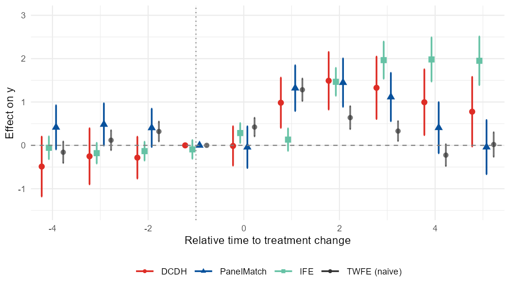
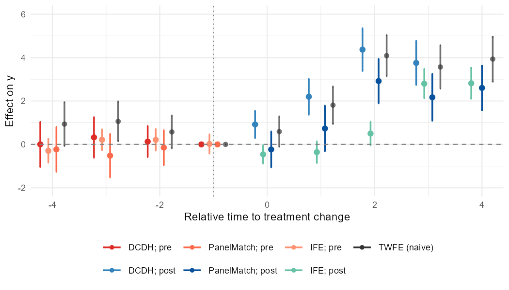
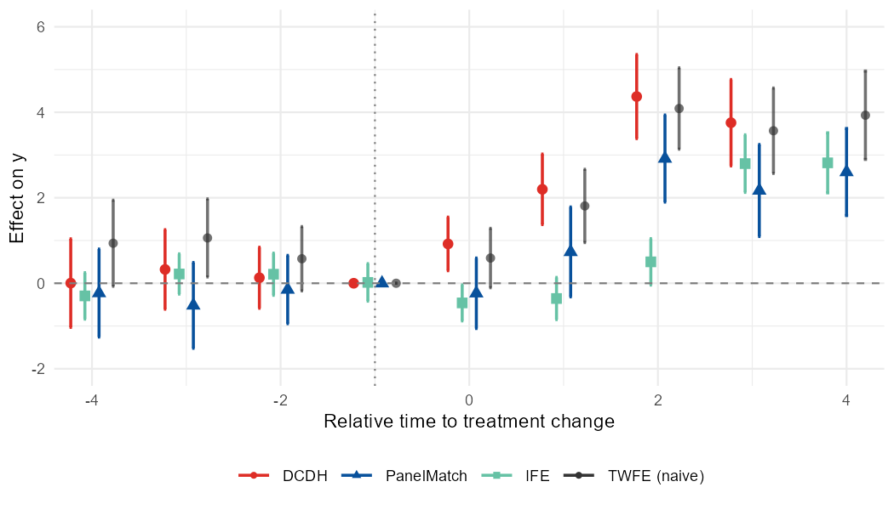
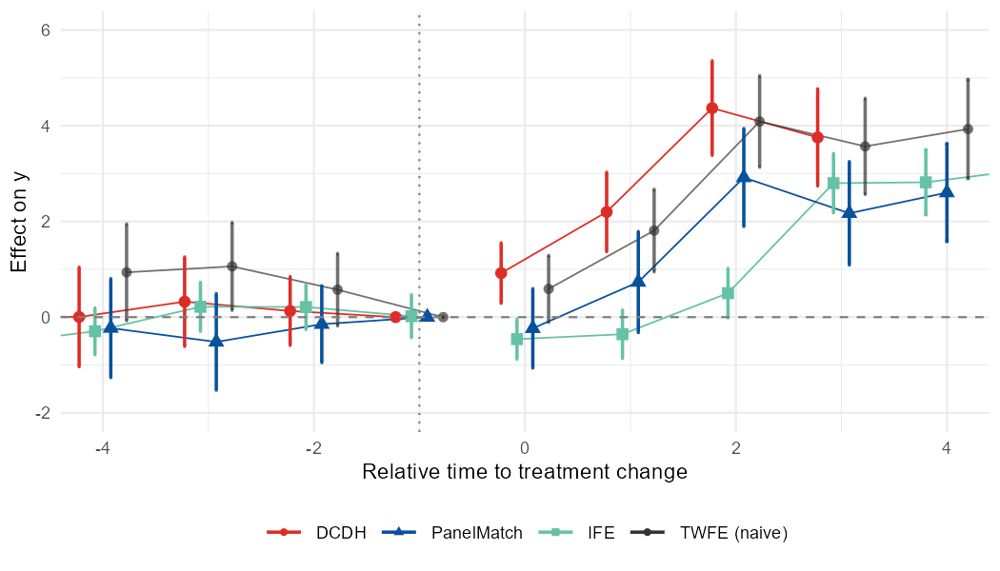

# *nonabsdid*: Visualize Heterogeneity-Robust DID Event Studies with Non-Absorbing Binary Treatments

<!-- badges: start -->
[](https://github.com/takuma1102/nonabsdid/actions/workflows/R-CMD-check.yaml)
[](https://takuma1102.r-universe.dev/nonabsdid)
[](https://lifecycle.r-lib.org/articles/stages.html#experimental)
<!-- badges: end -->

`nonabsdid` is an R package for visualizing and comparing heterogeneity-robust staggered DID event-study estimates under <ins>**non-absorbing**</ins> binary treatment, where treatment status may switch on and off over time, including treatment reversals. Its example output plot is as follows.



It covers existing multiple estimators and runs analysis via their
own packages, then puts their output on the same time axis, the same
tidy schema, and the same `ggplot2` panel so you can compare them at a glance.

Supported estimators:

- **DCDH** — de Chaisemartin & D'Haultfoeuille, via [`DIDmultiplegtDYN`](https://cran.r-project.org/package=DIDmultiplegtDYN).
- **PanelMatch** — Imai, Kim, & Wang, via [`PanelMatch`](https://cran.r-project.org/package=PanelMatch).
- **fect family** — Liu, Wang, & Xu, via [`fect`](https://cran.r-project.org/package=fect):
    - `IFE` (interactive fixed effects)
    - `FE`  (two-way fixed-effects imputation)
    - `MC`  (matrix completion)

> **Note:** The DCDH estimator depends on `DIDmultiplegtDYN`, which in turn
> requires `polars`. `polars` is not on CRAN, so install it from R-multiverse:
>
> ```r
> Sys.setenv(NOT_CRAN = "true")
> install.packages("polars",
>   repos = c("https://community.r-multiverse.org", "https://cloud.r-project.org"))
> ```

Plus an optional **naive TWFE reference series** (via `fixest`) drawn in a
neutral color so you can see what the heterogeneity-robust estimators are
correcting against.

## Installation

> [!NOTE]
> The version on CRAN is outdated. Install from GitHub or R-universe for the latest version.

```r
# Development version from GitHub:
# install.packages("pak")
pak::pak("takuma1102/nonabsdid")
```

You can install this package through r-universe.
```r
install.packages(
  "nonabsdid",
  repos = c("https://takuma1102.r-universe.dev", getOption("repos"))
)
```

The estimator packages themselves (`DIDmultiplegtDYN`, `PanelMatch`,
`fect`, `fixest`) are listed in `Suggests`, so install the ones you
plan to use.

## First-pass exploratory analysis

At the early stage of an analysis, use `nabs_event_study_simple()` to get
an initial sense of how the event-study estimates look. By default it runs a
deliberately cheap pass — DCDH plus two-way-FE imputation (`c("DCDH", "FE")`)
and a naive TWFE reference — and on large panels it works on a random sample
of units so the first look stays fast. The result is a single overlay plot to
inspect before moving on to estimator-specific tuning.

```r
library(nonabsdid)

res <- nabs_event_study_simple(
  mydata,
  outcome   = "y",
  treatment = "d",
  unit      = "id",
  time      = "t"
)

res$plot       # the figure
res$tidy       # combined tidy tibble across methods
res$per_method # per-method tidy tibbles
res$fits       # native estimator objects (only kept with keep_fits = TRUE)
```

Add the heavier estimators once the cheap pass looks reasonable — they are
opt-in because PanelMatch's bootstrap and IFE/MC's cross-validation are slow
on large panels:

```r
res <- nabs_event_study_simple(
  mydata, outcome = "y", treatment = "d", unit = "id", time = "t",
  methods = c("DCDH", "PanelMatch", "IFE", "FE", "MC"),
  full = TRUE        # use every unit, not just the first-pass sample
)
```

If a particular estimator's package is not installed, that estimator is
skipped with a message, and the remaining methods still produce output.

## Careful runs

For publication-ready work, switch to the full wrapper or to the underlying
packages directly. The unified wrapper:

```r
res_dcdh <- nabs_event_study(mydata,
                             outcome = "y", treatment = "d",
                             unit = "id", time = "t",
                             method = "DCDH",
                             lags = 6, leads = 8,
                             controls = c("x1", "x2"))

res_pm   <- nabs_event_study(mydata, ..., method = "PanelMatch")
res_ife  <- nabs_event_study(mydata, ..., method = "IFE")
res_fe   <- nabs_event_study(mydata, ..., method = "FE")
res_mc   <- nabs_event_study(mydata, ..., method = "MC")
```

Or call estimators directly and tidy their output:

```r
fit <- DIDmultiplegtDYN::did_multiplegt_dyn(
  df = mydata, outcome = "y", group = "id", time = "t",
  treatment = "d", effects = 9, placebo = 6
)
tidy_dcdh <- as_nabs_event_study(fit, outcome = "y")

# Naive TWFE reference for the plot:
ref <- naive_twfe(mydata, outcome = "y", treatment = "d",
                  unit = "id", time = "t",
                  lags = 6, leads = 8)

# Overlay everything:
nabs_event_plot(
  res_dcdh$tidy, res_pm$tidy, res_ife$tidy,
  reference = ref,
  xlim = c(-6, 8), ylim = c(-2, 2),
  ylab = "Effect on outcome"
)
```

## Plot styles

`nabs_event_plot()` offers two ways to encode the pre/post distinction, plus
an option to join point estimates with a thin line. Both arguments also flow
through `nabs_event_study_simple()` via `...`.

By default (`style = "prepost_color"`), each method gets its own color with
separate shades for pre- and post-treatment periods:




```r
nabs_event_plot(res_dcdh$tidy, res_pm$tidy, res_ife$tidy, reference = ref)
```

With `style = "method_shape"`, color encodes the *method* only, and the
pre/post distinction is carried by the marker shape (hollow circles for pre,
filled triangles for post). This reads cleanly in grayscale:




```r
nabs_event_plot(res_dcdh$tidy, res_pm$tidy, res_ife$tidy, reference = ref,
                style = "method_shape")
```

Set `connect = TRUE` (works with either style) to join each series' point
estimates with a thin line, drawn through the full path (pre and post are
connected, including across the treatment boundary):




```r
nabs_event_plot(res_dcdh$tidy, res_pm$tidy, res_ife$tidy, reference = ref,
                style = "method_shape", connect = TRUE)
```

## Working from existing results

If you have already run supported estimators, you can convert their result
objects into the common `nabs_event_study_tbl` schema with
`as_nabs_event_study()`.

```r
tidy_one <- as_nabs_event_study(fit_dcdh, outcome = "y")

tidy_all <- as_nabs_event_study(
  list(fit_dcdh, fit_panelmatch, fit_ife),
  outcome = "y"
)
```

Results returned by `nabs_event_study()` and `nabs_event_study_simple()` can also
be passed back to `as_nabs_event_study()`:

```r
res <- nabs_event_study(...)
tidy_res <- as_nabs_event_study(res)

res_simple <- nabs_event_study_simple(...)
tidy_simple <- as_nabs_event_study(res_simple)
```

## Tidy schema

All tidiers return a tibble of class `nabs_event_study_tbl` with these columns:

| column      | type    | description                                                      |
|-------------|---------|------------------------------------------------------------------|
| `time`      | int     | Relative period (0 = treatment onset/switch).                    |
| `estimate`  | num     | Point estimate.                                                  |
| `std.error` | num     | Standard error (may be `NA`).                                    |
| `conf.low`  | num     | Lower CI bound.                                                  |
| `conf.high` | num     | Upper CI bound.                                                  |
| `window`    | chr     | `"pre"` if `time < 0`, else `"post"`.                            |
| `method`    | chr     | `"DCDH"`, `"PanelMatch"`, `"IFE"`, `"FE"`, `"MC"`, `"TWFE"`, …   |
| `outcome`   | chr     | Outcome variable name.                                           |

All methods share this convention (time = 0 = treatment onset / the period of a treatment switch, time = -1 = reference). DCDH's native output anchors the reference at `0`, so it is shifted by one period internally to line up.

Anything coercible to a data frame with at least `time` and `estimate`
columns also flows through `as_nabs_event_study()`. Adding a new estimator
later means writing a one-line method that pulls the right slots — the
plotting code keeps working.

## Large panels and troubleshooting

A few things are worth knowing before you point this at a big panel:

- **DCDH needs `polars`.** The `DIDmultiplegtDYN` backend refers to the
  `polars` package; nonabsdid attaches it for you (with a one-time note), but
  it must be installed. If automatic loading fails, run `library(polars)`
  once and retry.
- **Unit / cluster ids are coerced automatically.** PanelMatch requires a
  numeric unit id and DCDH's polars backend cannot cluster on a string, so a
  non-numeric `unit` or `cluster` is replaced by integer codes (added as a new
  column). This only relabels ids and never changes estimates.
- **`fect` runs single-threaded by default.** For `IFE`/`FE`/`MC`,
  `parallel = FALSE` is the default: on large panels, copying the data to
  parallel workers tends to exhaust memory rather than help. Set
  `parallel = TRUE` (optionally with `cores`) for small panels.
- **Tuning knobs are first-class arguments.** `nabs_event_study()` accepts
  `cv`, `nboots`, `r`, `parallel`, and `cores` for the `fect` family, and
  `number.iterations` for PanelMatch's bootstrap. For the lightest IFE run,
  for example, fix the factors and skip cross-validation with
  `nabs_event_study(..., method = "IFE", cv = FALSE, r = 2, parallel = FALSE)`.
- **Samples can differ across estimators.** DCDH, `fect`, and PanelMatch drop
  missing rows differently, so a row with `NA` in a control may be used by one
  method and not another; nonabsdid notes when partial missingness is present.

## For Stata users

`nonabsdid` ships Stata interoperability:

``` r
# Read a .dta directly (labelled columns and .a-.z missings handled),
# or just pass the path straight to the wrappers:
mydata <- nabs_read_dta("mypanel.dta")
res    <- nabs_event_study_simple("mypanel.dta",
                                  outcome = "y", treatment = "d",
                                  unit = "id", time = "t")

# Stata-style argument names from did_multiplegt_dyn are accepted and
# translated with a message (group -> unit, effects -> leads, placebo -> lags):
res <- nabs_event_study(mydata, outcome = "y", treatment = "d", time = "t",
                        method = "DCDH",
                        group = "id", effects = 8, placebo = 6)

# Write the tidy estimates back out for a Stata-using coauthor:
nabs_write_dta(res$tidy, "event_study_results.dta")
```

See `vignette("nonabsdid-for-stata-users")` for the full option-by-option
mapping from `did_multiplegt_dyn` and the round trip back to `twoway`.

## Status

This package is experimental. The output schema is intended to be stable,
but the upstream estimator packages occasionally rearrange their internal
structures, so please pin versions in production code.

## Citation

If you use `nonabsdid` in your work, please kindly cite the package:

> Takuma Iwasaki (2026). *nonabsdid: Heterogeneity-Robust DID Event
> Studies with Non-Absorbing Binary Treatments*. R package version X.Y.Z.
> https://github.com/takuma1102/nonabsdid

Please also cite whichever underlying estimator(s) you actually used.

- de Chaisemartin, C., & D'Haultfœuille, X. (2026). "Difference-in-Differences Estimators of Intertemporal Treatment Effects." Review of Economics and Statistics.
- Imai, Kim, & Wang (2023) "Matching Methods for Causal Inference with Time-Series Cross-Sectional Data." *AJPS*.
- Liu, Wang, & Xu (2024) "A Practical Guide to Counterfactual Estimators for Causal Inference with Time-Series Cross-Sectional Data." *AJPS*.
