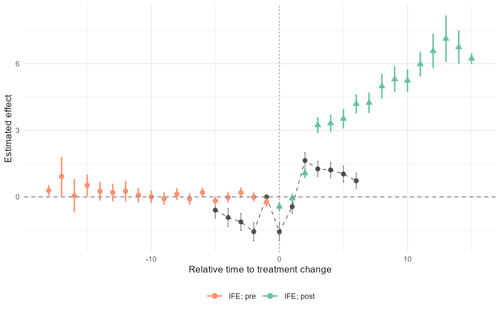

# nonabsdid

<!-- badges: start -->
[](https://github.com/takuma1102/nonabsdid/actions/workflows/R-CMD-check.yaml)
[](https://takuma1102.r-universe.dev/nonabsdid)
[](https://lifecycle.r-lib.org/articles/stages.html#experimental)
<!-- badges: end -->

`nonabsdid` is an R package for visualizing and comparing heterogeneity-robust staggered DID event-study estimates under <ins>**non-absorbing**</ins> binary treatment.



It covers existing multiple estimators and runs analysis via their
own packages, then puts their output on the same time axis, the same
tidy schema, and the same `ggplot2` panel so you can compare them at a glance.

Supported estimators:

- **DCDH** — de Chaisemartin & D'Haultfoeuille, via [`DIDmultiplegtDYN`](https://cran.r-project.org/package=DIDmultiplegtDYN).
- **PanelMatch** — Imai, Kim, & Wang, via [`PanelMatch`](https://cran.r-project.org/package=PanelMatch).
- **fect family** — Liu, Wang, & Xu, via [`fect`](https://cran.r-project.org/package=fect):
    - `IFE` (interactive fixed effects)
    - `FE`  (two-way fixed-effects imputation)
    - `MC`  (matrix completion)

> **Note:** The DCDH estimator depends on `DIDmultiplegtDYN`, which in turn
> requires `polars`. `polars` is not on CRAN, so install it from R-multiverse:
>
> ```r
> Sys.setenv(NOT_CRAN = "true")
> install.packages("polars",
>   repos = c("https://community.r-multiverse.org", "https://cloud.r-project.org"))
> ```

Plus an optional **naive TWFE reference series** (via `fixest`) drawn in a
neutral color so you can see what the heterogeneity-robust estimators are
correcting against.

## Installation

```r
# Development version from GitHub:
# install.packages("pak")
pak::pak("takuma1102/nonabsdid")
```

You can install this package through r-universe.
```r
install.packages(
  "nonabsdid",
  repos = c("https://takuma1102.r-universe.dev", getOption("repos"))
)
```

The estimator packages themselves (`DIDmultiplegtDYN`, `PanelMatch`,
`fect`, `fixest`) are listed in `Suggests`, so install the ones you
plan to use.

## First-pass exploratory analysis

At the early stage of an analysis, use `nabs_event_study_simple()` to get
an initial sense of how the event-study estimates look across estimators.
It runs the heterogeneity-robust estimators with reasonable defaults, fits
a naive TWFE reference, and gives you a single overlay plot to inspect
before moving on to estimator-specific tuning and robustness checks.

```r
library(nonabsdid)

res <- nabs_event_study_simple(
  mydata,
  outcome   = "y",
  treatment = "d",
  unit      = "id",
  time      = "t"
)

res$plot       # the figure
res$tidy       # combined tidy tibble across methods
res$per_method # per-method tidy tibbles
res$fits       # the native estimator objects, for diagnostics
```

If a particular estimator's package is not installed, that estimator is
skipped with a message, and the remaining methods still produce output.

## Careful runs

For publication-ready work, switch to the full wrapper or to the underlying
packages directly. The unified wrapper:

```r
res_dcdh <- nabs_event_study(mydata,
                             outcome = "y", treatment = "d",
                             unit = "id", time = "t",
                             method = "DCDH",
                             lags = 6, leads = 8,
                             controls = c("x1", "x2"))

res_pm   <- nabs_event_study(mydata, ..., method = "PanelMatch")
res_ife  <- nabs_event_study(mydata, ..., method = "IFE")
res_fe   <- nabs_event_study(mydata, ..., method = "FE")
res_mc   <- nabs_event_study(mydata, ..., method = "MC")
```

Or call estimators directly and tidy their output:

```r
fit <- DIDmultiplegtDYN::did_multiplegt_dyn(
  df = mydata, outcome = "y", group = "id", time = "t",
  treatment = "d", effects = 8, placebo = 6
)
tidy_dcdh <- as_nabs_event_study(fit, outcome = "y")

# Naive TWFE reference for the plot:
ref <- naive_twfe(mydata, outcome = "y", treatment = "d",
                  unit = "id", time = "t",
                  lags = 6, leads = 8)

# Overlay everything:
nabs_event_plot(
  res_dcdh$tidy, res_pm$tidy, res_ife$tidy,
  reference = ref,
  xlim = c(-6, 8), ylim = c(-2, 2),
  ylab = "Effect on outcome"
)
```

## Working from existing results

If you have already run supported estimators, you can convert their result
objects into the common `nabs_event_study_tbl` schema with
`as_nabs_event_study()`.

```r
tidy_one <- as_nabs_event_study(fit_dcdh, outcome = "y")

tidy_all <- as_nabs_event_study(
  list(fit_dcdh, fit_panelmatch, fit_ife),
  outcome = "y"
)
```

Results returned by `nabs_event_study()` and `nabs_event_study_simple()` can also
be passed back to `as_nabs_event_study()`:

```r
res <- nabs_event_study(...)
tidy_res <- as_nabs_event_study(res)

res_simple <- nabs_event_study_simple(...)
tidy_simple <- as_nabs_event_study(res_simple)
```

## Tidy schema

All tidiers return a tibble of class `nabs_event_study_tbl` with these columns:

| column      | type    | description                                                      |
|-------------|---------|------------------------------------------------------------------|
| `time`      | int     | Relative period (0 = treatment onset).                           |
| `estimate`  | num     | Point estimate.                                                  |
| `std.error` | num     | Standard error (may be `NA`).                                    |
| `conf.low`  | num     | Lower CI bound.                                                  |
| `conf.high` | num     | Upper CI bound.                                                  |
| `window`    | chr     | `"pre"` if `time < 0`, else `"post"`.                            |
| `method`    | chr     | `"DCDH"`, `"PanelMatch"`, `"IFE"`, `"FE"`, `"MC"`, `"TWFE"`, …   |
| `outcome`   | chr     | Outcome variable name.                                           |

Anything coercible to a data frame with at least `time` and `estimate`
columns also flows through `as_nabs_event_study()`. Adding a new estimator
later means writing a one-line method that pulls the right slots — the
plotting code keeps working.

## Status

This package is experimental. The output schema is intended to be stable,
but the upstream estimator packages occasionally rearrange their internal
structures, so please pin versions in production code.

## Citation

If you use this package, please also cite the underlying estimators:

- de Chaisemartin & D'Haultfœuille (2024) "Difference-in-Differences Estimators of Intertemporal Treatment Effects."
- Imai, Kim, & Wang (2023) "Matching Methods for Causal Inference with Time-Series Cross-Sectional Data." *AJPS*.
- Liu, Wang, & Xu (2024) "A Practical Guide to Counterfactual Estimators for Causal Inference with Time-Series Cross-Sectional Data." *AJPS*.
