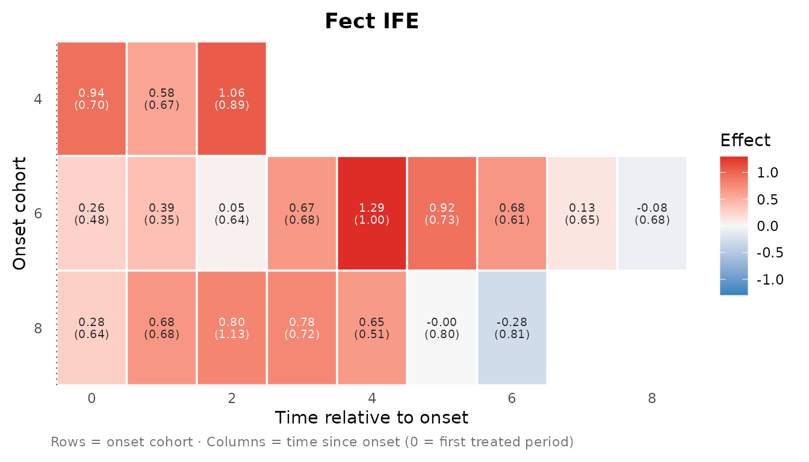
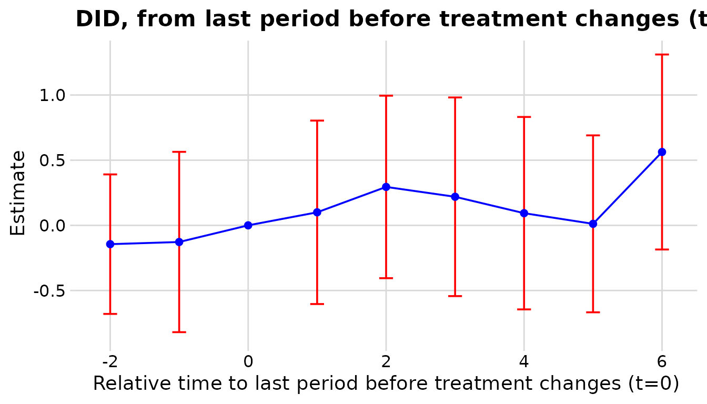
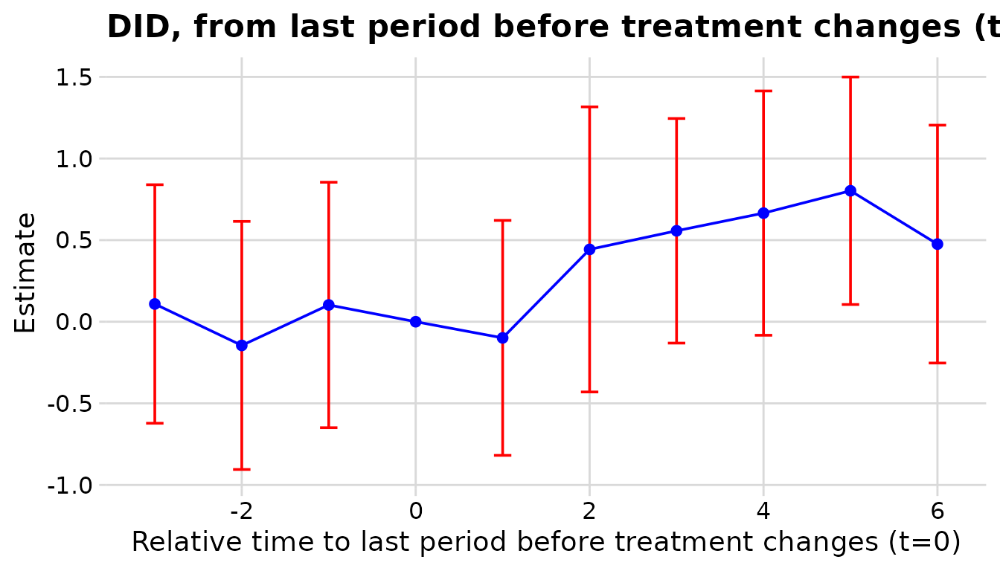
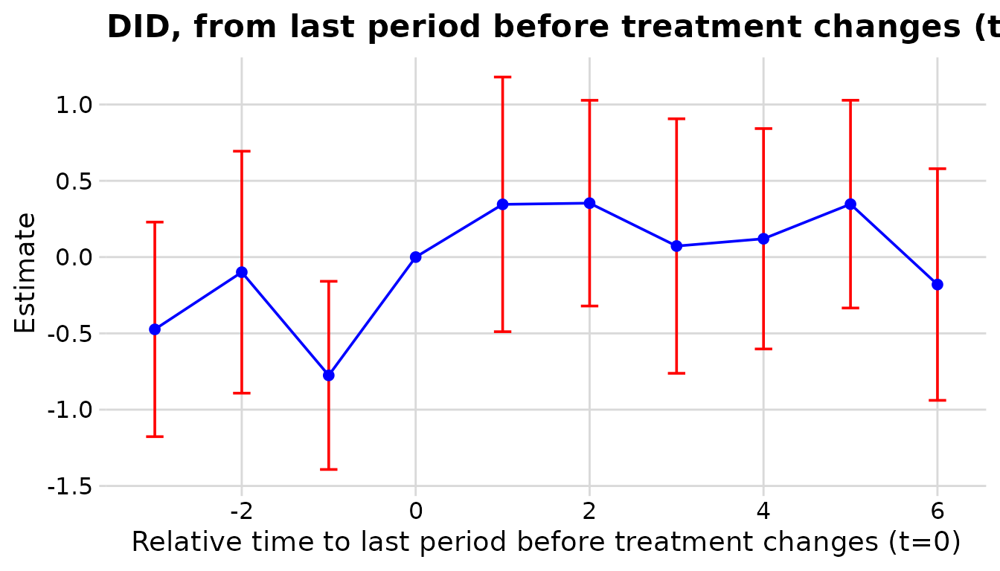
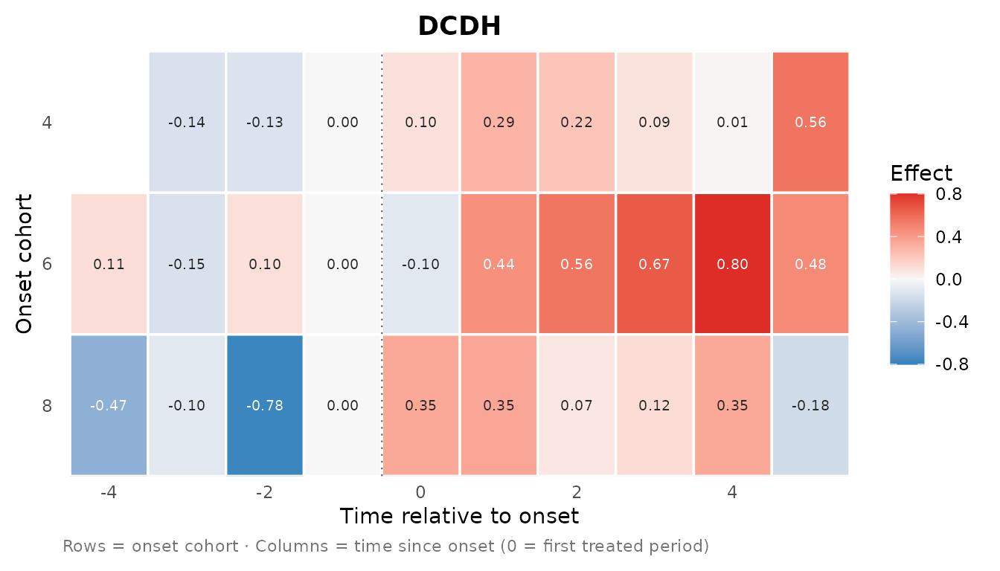
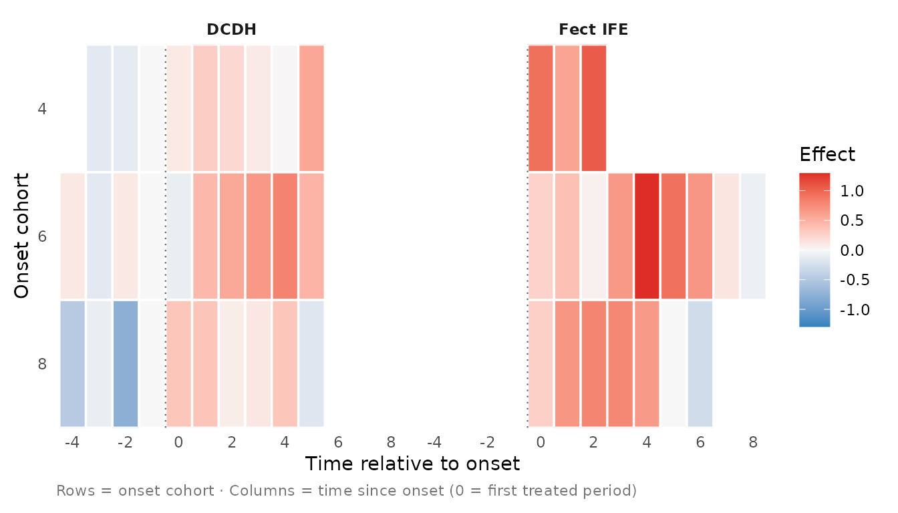
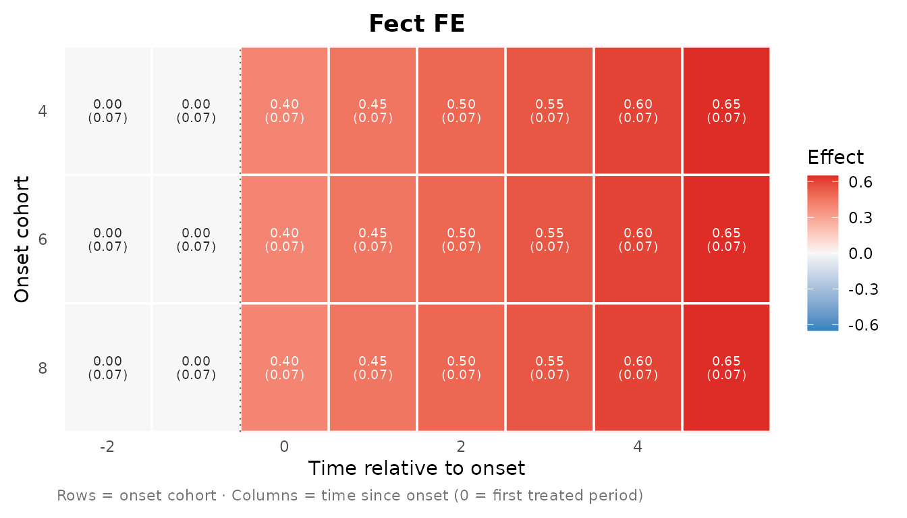
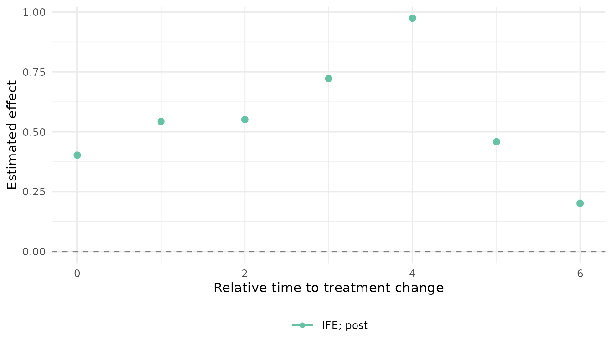

# Cohort-by-time effect matrices and heatmaps

``` r

library(nonabsdid)
```

> **Experimental.** This is a separate, newer feature line from the
> event-study workflow in *Getting started*. The schema and function
> names may still change. It supports **DCDH** and the **fect** family
> only; see [Why not PanelMatch?](#why-not-panelmatch) below.

## Event study vs. effect matrix

The main `nonabsdid` workflow (\[nabs_event_study()\] /
\[nabs_event_plot()\]) collapses every treated cohort onto a single
relative-time axis: one curve per estimator. That is the right summary
most of the time, but it hides *which* cohorts drive the average.

The **effect matrix** keeps the onset cohort as a second dimension.
Instead of a curve you get a grid – rows are onset cohorts, columns are
relative (or calendar) time, and the fill is the estimated effect –
drawn as a heatmap. It is the two-dimensional companion to the
event-study overlay, built from the same estimator objects.

Three user-facing pieces mirror the event-study API:

- [`nabs_effect_cells()`](https://takuma1102.github.io/nonabsdid/reference/nabs_effect_cells.md)
  – fit one estimator and return its cohort cells.
- [`as_nabs_effect_cells()`](https://takuma1102.github.io/nonabsdid/reference/as_nabs_effect_cells.md)
  – coerce an existing estimator object into the cell schema.
- [`plot_effect_matrix()`](https://takuma1102.github.io/nonabsdid/reference/plot_effect_matrix.md)
  – draw one or more cell tables as heatmaps.

## A toy non-absorbing panel

``` r

set.seed(1)
N <- 120; TT <- 14
panel <- expand.grid(id = 1:N, t = 1:TT)
grp   <- panel$id %% 4                         # group 0 = never treated
onset <- c(`1` = 4L, `2` = 6L, `3` = 8L)[as.character(grp)]
# a quarter of switchers turn OFF again 3 periods later (non-absorbing)
off   <- (panel$id %% 8 == 1) & !is.na(onset) & panel$t >= onset + 3L
panel$d <- as.integer(!is.na(onset) & panel$t >= onset & !off)
panel$y <- rnorm(N, sd = .5)[panel$id] + 0.15 * panel$t +
  ifelse(panel$d == 1, 0.4, 0) + rnorm(nrow(panel))
```

## One-step fit: `nabs_effect_cells()`

[`nabs_effect_cells()`](https://takuma1102.github.io/nonabsdid/reference/nabs_effect_cells.md)
wires up what a cohort breakdown needs for each estimator (a unit-level
onset cohort for DCDH; `keep.sims = TRUE` for fect bootstrap cell SEs),
so you only pass the usual arguments.

``` r

res_ife <- nabs_effect_cells(
  panel, outcome = "y", treatment = "d", unit = "id", time = "t",
  method = "IFE", lags = 4, leads = 6, nboots = 100
)
#> For identification purposes, units whose number of untreated periods <5 are dropped automatically.
#> Cross-validating ...
#> Criterion: Mean Squared Prediction Error
#> Interactive fixed effects model...
#> r = 2; sigma2 = 0.89113; IC = 2.40771; PC = 2.98096; MSPE = 2.70052
#> 
#>  r* = 2
res_ife$cells
#> # <nabs_effect_cell_tbl>: 19 cells, 3 cohorts, methods: "IFE"
#> # A tibble: 19 × 12
#>    cohort event_time calendar_time estimate std.error conf.low conf.high     n
#>     <int>      <int>         <int>    <dbl>     <dbl>    <dbl>     <dbl> <int>
#>  1      4          0             4  0.938       0.700   -0.848     0.903    15
#>  2      4          1             5  0.580       0.672   -1.91      1.30     15
#>  3      4          2             6  1.06        0.889   -1.34      1.45     15
#>  4      6          0             6  0.260       0.477   -0.801     1.07     30
#>  5      6          1             7  0.388       0.346   -0.771     0.757    30
#>  6      6          2             8  0.0478      0.643   -0.939     1.96     30
#>  7      6          3             9  0.667       0.679   -0.736     2.20     30
#>  8      6          4            10  1.29        1.00    -1.31      2.48     30
#>  9      6          5            11  0.921       0.735   -1.10      1.92     30
#> 10      6          6            12  0.682       0.611   -0.769     1.95     30
#> 11      6          7            13  0.130       0.648   -1.45      0.906    30
#> 12      6          8            14 -0.0850      0.684   -1.08      1.69     30
#> 13      8          0             8  0.278       0.637   -1.17      1.31     30
#> 14      8          1             9  0.680       0.677   -1.10      1.48     30
#> 15      8          2            10  0.800       1.13    -2.69      2.43     30
#> 16      8          3            11  0.778       0.716   -1.15      1.55     30
#> 17      8          4            12  0.655       0.513   -0.431     1.74     30
#> 18      8          5            13 -0.00298     0.800   -1.04      1.17     30
#> 19      8          6            14 -0.280       0.809   -0.901     1.85     30
#> # ℹ 4 more variables: window <chr>, method <chr>, outcome <chr>,
#> #   se_method <chr>
```

``` r

plot_effect_matrix(res_ife$cells, show_estimates = TRUE, show_se = TRUE)
```



A single-method call is titled with the method automatically, and
`show_se = TRUE` prints the standard error (in parentheses) beneath each
estimate. The fect surface only covers **treated** cells, so the matrix
starts at `event_time = 0` (the first treated period) and has no
pre-period column.

For DCDH, `dcdh_strategy = "loop"` (the default) re-estimates the event
study once per onset cohort against the never-treated units; `"by"`
instead issues a single `did_multiplegt_dyn(..., by = cohort)` call.

``` r

res_dcdh <- nabs_effect_cells(
  panel, outcome = "y", treatment = "d", unit = "id", time = "t",
  method = "DCDH", lags = 3, leads = 5, dcdh_strategy = "loop"
)
#> ℹ Attached polars for the DCDH backend.
#> The number of placebos which can be estimated is at most 2.The command will therefore try to estimate 2 placebo(s).
```



``` r

plot_effect_matrix(res_dcdh$cells, show_estimates = TRUE, show_se = TRUE)
```



Unlike fect, DCDH reports placebo (pre-period) cells and a reference
period (normalized to `0` at `event_time = -1`), so its matrix spans
negative event time too.

## Comparing methods

The recommended view is **one heatmap per method** (above): each is
titled with its method and stays readable. If you do want them in one
figure, passing several cell tables facets them with a shared fill scale
and legend:

``` r

plot_effect_matrix(res_dcdh$cells, res_ife$cells)
```



The faceted view is convenient but gets crowded fast (especially with
in-tile labels), which is why per-method plots are the default emphasis.

Either way, **read this as triangulation of the *pattern*, not as
cell-by-cell equality.** The two estimators line up on the same axes –
both define the cohort as the onset period and anchor `event_time = 0`
at the first treated period – but they do not target identical
quantities:

- *Different estimands / identification.* fect imputes a counterfactual
  ($`Y - \hat Y(0)`$) from a fixed-effects / factor model; DCDH forms
  long differences from the period before each switch. Level offsets
  between the two are expected.
- *Different controls.* The DCDH `"loop"` strategy compares each cohort
  to the never-treated; fect’s counterfactual is model-based over all
  controls.
- *Different coverage.* fect is post-only; DCDH adds placebos and a
  reference cell.
- *Non-absorbing wrinkle.* The cohort is the *first* onset. Units that
  switch off and on again contribute to large-`event_time` cells under
  both methods, but each handles carryover differently, so those cells
  are the least comparable.

The fill encodes the point estimate only. Standard errors live in the
`std.error` column and can be drawn in each tile with `show_se = TRUE`
(`"bootstrap"` for fect, `"native"` for DCDH; see the schema below). For
claims about whether two cells differ, look at those SEs rather than the
colours.

## Working from existing objects

If you already fit an estimator, coerce it with
[`as_nabs_effect_cells()`](https://takuma1102.github.io/nonabsdid/reference/as_nabs_effect_cells.md).
For fect you need `imputed_outcomes()` (fect \>= 2.4.0); for bootstrap
cell SEs the fit must have been run with `se = TRUE, keep.sims = TRUE`.
For DCDH, pass an object run with a unit-level cohort `by` variable.

``` r

fit <- fect::fect(y ~ d, data = panel, index = c("id", "t"),
                  method = "fe", force = "two-way",
                  se = TRUE, nboots = 100, keep.sims = TRUE)
cells <- as_nabs_effect_cells(fit, method = "FE", outcome = "y")
```

A data-frame escape hatch needs no estimator packages – handy for
testing the plot or building cells from numbers you already have:

``` r

raw <- expand.grid(cohort = c(4L, 6L, 8L), event_time = -2:5)
raw$estimate  <- with(raw, ifelse(event_time < 0, 0, 0.4 + 0.05 * event_time))
raw$std.error <- 0.07
cells <- as_nabs_effect_cells(raw, method = "FE", outcome = "y")
plot_effect_matrix(cells, show_estimates = TRUE, show_se = TRUE)
```



## Collapsing back to an event study

[`aggregate_effects()`](https://takuma1102.github.io/nonabsdid/reference/aggregate_effects.md)
averages cells over cohorts and returns a `nabs_event_study_tbl`, making
explicit that the event study is the cohort-collapsed view of the same
cells. (Re-aggregated standard errors are not computed, so they come
back `NA`; use it for a quick overlay, not inference.)

``` r

agg <- aggregate_effects(res_ife$cells, by = "event_time")
#> ℹ Aggregated over cohorts; std.error is "NA" (re-aggregated SEs need replicate
#>   draws).
nabs_event_plot(agg, xlim = c(0, 6))
```



## The cell schema

[`as_nabs_effect_cells()`](https://takuma1102.github.io/nonabsdid/reference/as_nabs_effect_cells.md)
returns a tibble of class `nabs_effect_cell_tbl`:

| column          | type | description                                           |
|-----------------|------|-------------------------------------------------------|
| `cohort`        | int  | Onset calendar period (first treated period).         |
| `event_time`    | int  | Relative period; `0` = onset.                         |
| `calendar_time` | int  | `cohort + event_time` (may be `NA`).                  |
| `estimate`      | num  | Cell point estimate.                                  |
| `std.error`     | num  | Standard error (may be `NA`).                         |
| `conf.low/high` | num  | CI bounds.                                            |
| `n`             | int  | Treated cells aggregated (fect only; `NA` for DCDH).  |
| `window`        | chr  | `"pre"` / `"post"`.                                   |
| `method`        | chr  | Estimator label.                                      |
| `outcome`       | chr  | Outcome name.                                         |
| `se_method`     | chr  | `"bootstrap"` (fect), `"native"` (DCDH), or `"none"`. |

The `se_method` column records how uncertainty was produced. fect cells
use the bootstrap surface (`imputed_outcomes(replicates = TRUE)`),
re-aggregated within each replicate; DCDH cells carry the estimator’s
own SEs; otherwise SEs are `NA`.

## Why not PanelMatch?

A faithful cohort matrix needs cohort-level estimates *and* cohort-level
uncertainty. For DCDH and fect both fall out of objects the packages
already expose. PanelMatch reports lead-specific ATTs aggregated over
all matched sets; recovering a per-cohort cell means re-aggregating
matched-set effects by switch time **and** re-running the matched-set
bootstrap on that re-aggregation to get honest SEs. That is real work
and out of scope for this pass, so PanelMatch is omitted here rather
than shipped with naive (wrong) standard errors. The `se_method` column
is reserved so a PanelMatch path can slot in later without changing the
plotting code.
